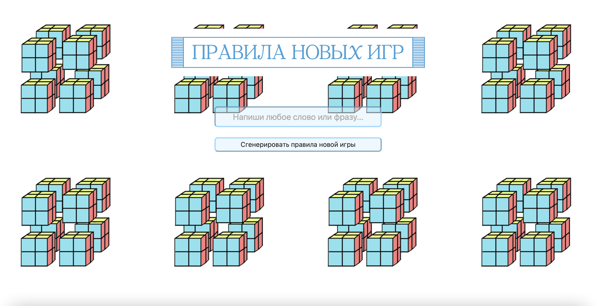
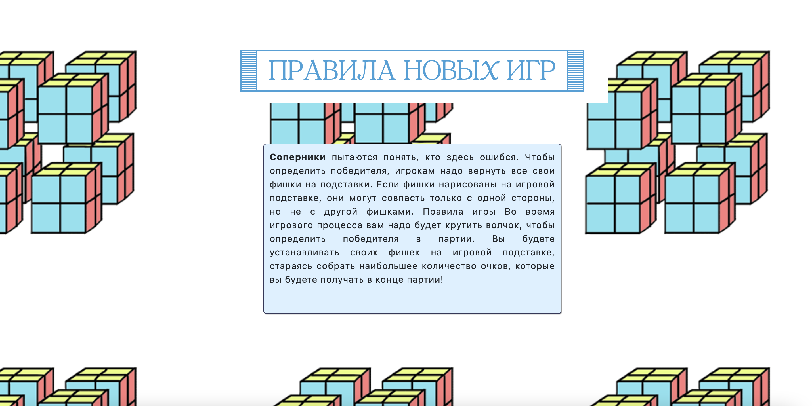

# New_Games_Rules_Generator
The generator of new absurd games rules, based on the pre-trained GPT-2 model.

# Генератор новых правил для настольных игр

## Описание

На основе фразы, введенной пользователей, нейросеть генерирует новые правила настольных игр. 

## Принцип работы

**Пользователь** вводит фразу на сайте. **Сайт** использует дообученную модель GPT-2 и выдаёт пользователю сгенерированное правило для настольной игры.

## Сбор данных и препроцессинг

Для проекта было собрано более 2000 правил для настольных игр. Парсинг проводился с сайта [Мосигра](https://www.mosigra.ru/). Далее был обработан полученный датасет для повышения эффективности обучения модели нейросети. 

## Обучение нейросети

Была использована модель 'sberbank-ai/rugpt3small_based_on_gpt2', дообученная на своём датасете.

## Имплементация на сайт

С помощью фреймворка Flask сделан сайт и настроена выдача результата.

## Пример работы

